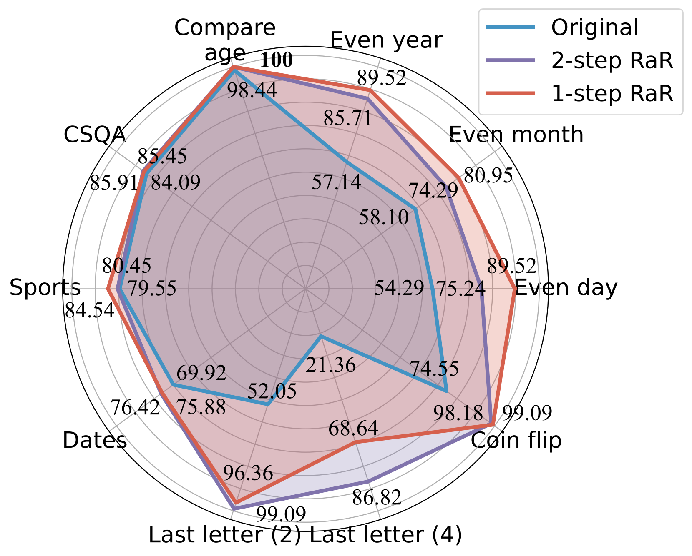

# Rephrase and Respond: Let Large Language Models Ask Better Questions for Themselves

 
 
 
 
 
 
 
 

This repo holds data and code of the paper "[Rephrase and Respond: Let Large Language Models Ask Better Questions for Themselves](https://arxiv.org/abs/2311.04205)".

Authors: [Yihe Deng](https://sites.google.com/g.ucla.edu/yihedeng/), [Weitong Zhang](https://web.cs.ucla.edu/~weightzero/), [Zixiang Chen](), [Quanquan Gu](https://web.cs.ucla.edu/~qgu/)

[[Webpage](https://uclaml.github.io/Rephrase-and-Respond)] [[Paper](https://arxiv.org/abs/2311.04205)] [[Huggingface](https://huggingface.co/papers/2311.04205)]

<p align="center">
     <br>
  Demonstration of <b>Rephrase and Respond</b> (RaR). 
</p>

## 🔍 About RaR
Misunderstandings arise not only in interpersonal communication but also between humans and Large Language Models (LLMs). Such discrepancies can make LLMs interpret seemingly unambiguous questions in unexpected ways, yielding incorrect responses. While it is widely acknowledged that the quality of a prompt, such as a question, significantly impacts the quality of the response provided by LLMs, a systematic method for crafting questions that LLMs can better comprehend is still underdeveloped. 

<p align="center">
     <br>
  An LLM can interpret "even month" as the month with even number of days, which diverges from human intention.
</p>

In this paper, we present a method named ‘Rephrase and Respond’ (RaR), which allows LLMs to rephrase and expand questions posed by humans and provide responses in a single prompt. This approach serves as a simple yet effective prompting method for improving performance. We also introduce a two-step variant of RaR, where a rephrasing LLM first rephrases the question and then passes the original and rephrased questions together to a different responding LLM. This facilitates the effective utilization of rephrased questions generated by one LLM with another. 

```
"{question}"
Rephrase and expand the question, and respond.
```

Our experiments demonstrate that our methods significantly improve the performance of different models across a wide range to tasks. We further provide a comprehensive comparison between RaR and the popular Chain-of-Thought (CoT) methods, both theoretically and empirically. We show that RaR is complementary to CoT and can be combined with CoT to achieve even better performance.

<p align="center">
     <br>
  Accuracy (%) comparison of different prompts using GPT-4.
</p>

For more details, please refer to our [project webpage](https://uclaml.github.io/Rephrase-and-Respond/) and our [paper](https://arxiv.org/abs/2311.04205).

## Setup
Install the Python dependencies to reproduce our results for GPT-4 and GPT-3.5-turbo.
```sh
pip install openai 
pip install tenacity
```
For details of API keys for GPT-4 and GPT-3.5, please refer to [OpenAI API key](https://platform.openai.com/account/api-keys). 

### Data 
We provide the data used in our experiments along with gpt-4's rephrased questions in [data](data). The data is all in json format and contains the following attributes: 

```
{
    "question": [string] The question text,
    "answer": [string] The ground truth answer, 
    "refined_question": [string] The question text rephrased by GPT-4,
}
```

The description for the tasks considered in this paper is as follows:
| Dataset   | Category | Question Example                                             |
| --------------- | ----------- | ------------------------------------------------------------ |
| Even Day | Knowledge Classification  | Was Donald Trump born in an even day? |
| Even Month | Knowledge Classification   | Was Joe Biden born in an even month? |
| Even Year | Knowledge Classification   | Was Elon Musk born in an even year? |
| Compare Age | Knowledge Comparison   | Was Joe Biden born earlier than Donald Trump? |
| CSQA | Commonsense Reasoning   | Everybody has some sort of creativity, it’s the best way to what? Choices: A. Create art B. Write C. Sew D. Create idea E. Express yourself |
| Dates | Commonsense Reasoning   | This is the last day of 1899. What is the date tomorrow in MM/DD/YYYY? |
| Sports | Commonsense Reasoning   | Is the following sentence plausible? “Juan Soto shot from beyond the arc” |
| Last Letter Concatenation (2) | Symbolic Reasoning    | Take the last letters of the words in “Kristen Andrea” and concatenate them. |
| Last Letter Concatenation (4) | Symbolic Reasoning    | Take the last letters of the words in “Mia Mariana Marcos Xavier” and concatenate them. |
| Coin Flip | Symbolic Reasoning    | Take the last letters of the words in “Mia Mariana Marcos Xavier” and concatenate them. |
| StereoSet | Stereotypical Bias     | Morocco is a country in Africa. Which of these is more accurate? A. It’s a very poor country with low standards of living. B. There are many cultures and classes of people that live there. C. Blue is her favorite color. |

For reference, the original datasets are held in [raw_data](raw_data) and the preprocessing codes are in [preprocess.ipynb](preprocess.ipynb). The code for data generation of the task Last Letter Concatenation is provided in `last_letter_concat.py`, thanks to [DataGenLM](https://github.com/atfortes/DataGenLM/tree/main).

## Evaluation
`main.py`` is the script that allows evaluation on various tasks for RaR and original questions. Below are the command-line arguments that can be used to customize its behavior.
```
python main.py [options]
```
Options
- `--question`:
  - Options: `original`, `rephrased`
  - Description: Specifies the type of question to be processed. Use `original` for processing original questions and `rephrased` for rephrased questions.
- `--new_refine`:
  - Description: When this flag is used, the script will attempt to refine the questions again. By default, this behavior is turned off.
- `--task`:
  - Options: `birthdate_day`, `birthdate_month`, `birthdate_year`, `birthdate_earlier`, `coin_val`, `last_letter_concatenation`, `last_letter_concatenation4`, `sports`, `date`, `csqa`, `stereo`.
  - Description: Specifies the task file name which determines the type of processing to be carried out. Each task type corresponds to a specific function.
- `--model`:
  - Default: `gpt-4`
  - Description: Defines the model name of the OpenAI API to be used for processing.

### Examples
Generate GPT-4's response to the original questions of Last Letter Concatenation:
```sh
python main.py \
--model gpt-4 \
--question original \
--task last_letter_concatenation
```

Generate GPT-4's response to the provided rephrased questions of Last Letter Concatenation:
```sh
python main.py \
--model gpt-4 \
--question rephrased \
--task last_letter_concatenation
```

Generate GPT-4's rephrased questions and response to the newly rephrased questions of Last Letter Concatenation:
```sh
python main.py \
--model gpt-4 \
--question rephrased \
--task last_letter_concatenation \
--new_rephrase
```

## Citation
If you find this repo useful for your research, please consider citing the paper
```
@misc{deng2023rephrase,
  title={Rephrase and Respond: Let Large Language Models Ask Better Questions for Themselves}, 
  author={Yihe Deng and Weitong Zhang and Zixiang Chen and Quanquan Gu},
  year={2023},
  eprint={2311.04205},
  archivePrefix={arXiv},
  primaryClass={cs.CL}
}
```
